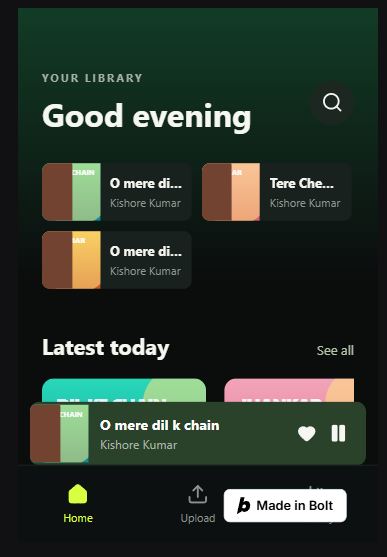
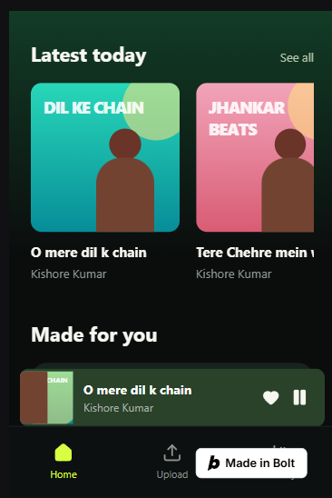
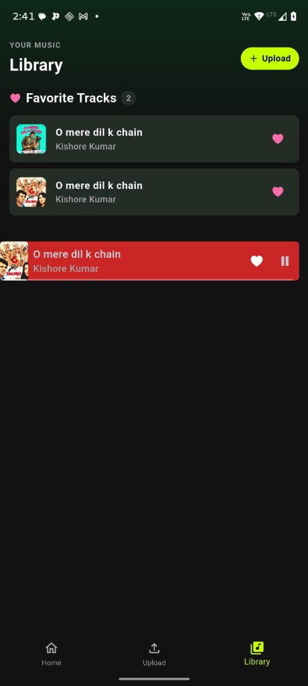
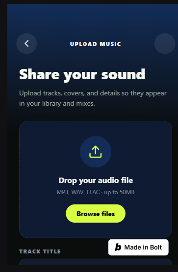
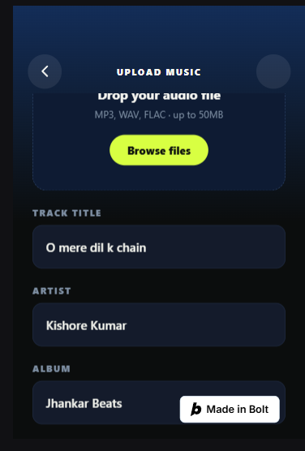
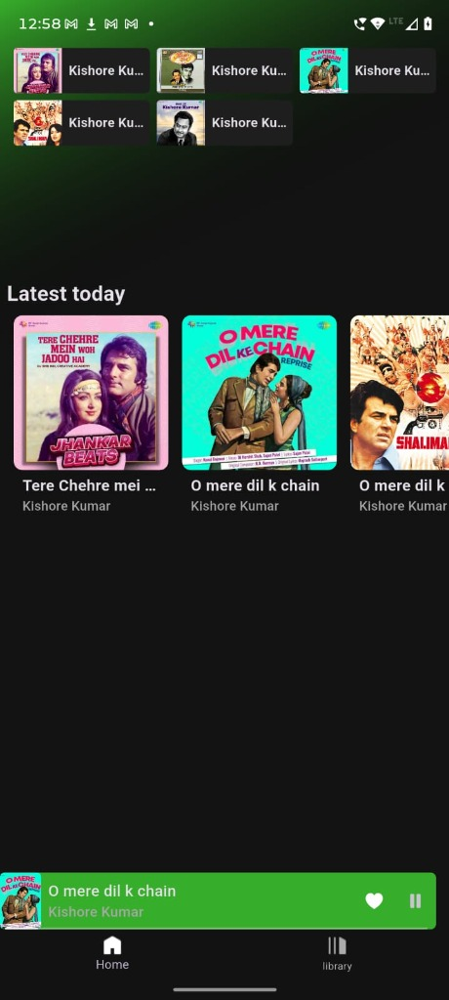

# 🎵 SoundWave - Full-Stack Cross-Platform Music Streaming App

A production-grade, full-stack music streaming platform engineered with **Flutter**, **Riverpod 2.0**, **FastAPI**, **PostgreSQL**, and **Cloudinary CDN**. SoundWave delivers high-fidelity audio playback, continuous background audio service, cloud media uploading, and real-time state synchronization wrapped in a modern Spotify-inspired dark UI.

---

## 📱 Screen Showcase & Feature Walkthrough

### 1. Home Dashboard & Content Discovery



* **Top Greeting & Quick Actions**: Time-aware `"Good evening"` header with instant search access and sub-labels.
* **Recently Played 2-Column Grid**: Loads recently played tracks cached locally in **HiveDB** for instant offline retrieval.
* **"Latest Today" & "Made For You" Carousels**: Asynchronously fetched song feeds with cover artwork, artist metadata, and horizontal touch scrolling.
* **Dynamic Background Gradient**: Blends dynamic colors based on the currently playing track's artwork palette.

---

### 2. Personal Library & Real-Time Favorites


* **Curated Favorites Collection**: Real-time list of liked tracks with instant heart toggle controls (`CupertinoIcons.heart_fill`).
* **Live Counter Badge**: Real-time track count badge (`Favorite Tracks 2`).
* **Quick Upload Button**: Integrated `+ Upload` button in the header for creator access.
* **Empty State Handling**: Clean empty state display when no tracks are favorited.

---

### 3. Creator Studio - Upload Music



* **Audio Dropzone with Waveform Visualizer**: Dashed dropzone supporting MP3/WAV/FLAC audio files up to 50MB with instant waveform preview via `audio_waveforms`.
* **Thumbnail Cover Art Selector**: High-res album art picker with live image preview.
* **Form Inputs & Color Accent**: Field inputs for `TRACK TITLE`, `ARTIST`, and an integrated `ColorPicker` for custom song color accents.
* **Cloud Delivery Pipeline**: Direct multipart form upload to **Cloudinary CDN** for worldwide streaming distribution.

---

### 4. Background Audio Player & Persistent Mini-Player Bar


* **Pinned Bottom Mini-Player (`MusicSlab`)**: Stays permanently pinned directly above the bottom navigation bar across all tabs (`Home`, `Upload`, `Library`).
* **Live Position Tracking**: Real-time position progress bar driven by `StreamBuilder` position streams.
* **Background Isolate (`just_audio_background`)**: Uninterrupted audio streaming when the app is minimized or when the device screen is locked, complete with system notification controls.
* **Slide-Up Full Screen Player**: Interactive full-screen player with Hero transitions, cover art, and playback controls.

---

## ⚡ Technical Highlights & System Architecture

### 1. Functional Error Handling (`fpdart`)
Instead of relying on fragile try-catch blocks that cause runtime null crashes, all repository operations return a functional monad: `Either<Failure, Success>`.
* `Left(Failure)`: Explicitly encapsulates network failures, HTTP 404s, or validation errors.
* `Right(Success)`: Contains strongly-typed data models (`UserModel`, `SongModel`).

### 2. State Management & Dependency Injection (`Riverpod 2.0`)
* **Reactive Providers**: Decouples UI widgets from business logic using `riverpod_generator` and `AsyncValue`.
* **Auto Invalidation**: Uploading or favoriting a song automatically invalidates `getAllSongsProvider` and `getFavSongsProvider`, refreshing the UI globally without full-page reloads.

### 3. High-Performance Asynchronous Microservices (`FastAPI`)
* **Asynchronous Routing**: Asynchronous Python endpoints powered by `async/await` and Starlette.
* **SQLAlchemy ORM Joined Loads**: Optimized database queries utilizing `joinedload(Favorite.song)` to eliminate N+1 query overhead for favorites listings.
* **Secure JWT Authentication**: Salted `bcrypt` password hashing and header-based JWT authentication middleware.

---

## 🛠️ Complete Tech Stack

| Component | Technologies Used |
| :--- | :--- |
| **Mobile Frontend** | Flutter (Dart 3.x), Riverpod 2.0, fpdart, Flex Color Picker, Audio Waveforms |
| **Audio Engine** | JustAudio, JustAudioBackground (Android Audio Service, Notification Controls) |
| **Local Caching** | HiveDB (Offline track history), SharedPreferences (JWT session tokens) |
| **Backend API** | Python 3.11+, FastAPI, Pydantic Schemas, Uvicorn, CORS Middleware |
| **Database & ORM** | PostgreSQL / SQLite, SQLAlchemy ORM, Alembic Migrations |
| **Cloud & Media** | Cloudinary SDK (Audio Track & Image Thumbnail CDN Streaming) |

---

## 🚀 Local Development Setup

### 1. Backend Setup (`server/`)
```bash
cd server
python -m venv venv_win
venv_win\Scripts\activate
pip install -r requirements.txt

# Start FastAPI server on local network
uvicorn main:app --reload --host 0.0.0.0 --port 8000
```

### 2. Mobile Client Setup (`client/`)
```bash
cd client
flutter pub get

# Enable ADB USB port forwarding for physical device debugging
adb reverse tcp:8000 tcp:8000

# Run on connected device or emulator
flutter run
```

---

## 👤 Author
* **GitHub**: [KumarMohit85](https://github.com/KumarMohit85)
* **Repository**: [MusicPlayerApp](https://github.com/KumarMohit85/MusicPlayerApp)
